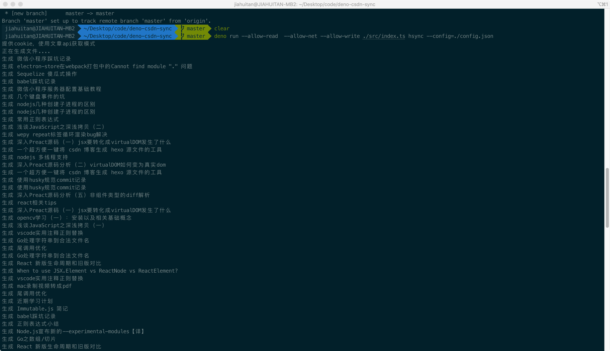

### deno-csdn-sync-hexo

> deno 初体验...

deno 实现的 csdn 博客生成 hexo 博客源文件

#### 使用

使用说明[参考](https://github.com/flytam/blog/issues/14)。并新建一个`config.json`配置文件

```bash
git clone git@github.com:flytam/deno-csdn-sync-hexo.git
deno run --allow-read  --allow-net --allow-write ./src/index.ts hsync --config=./config.json
```

#### 开发

```bash
make cache
make run
```

#### 打包

```bash
make install
```

#### 发布执行包

todo

travis

分割线

---

deno 初体验，实战记录一个`node`项目迁移到`deno`需要做什么

> 本文以`csdnsynchexo`迁移到`deno`实现进行一步步探索说明。

> [csdnsynchexo](https://github.com/flytam/CsdnSyncHexo)是一个爬取 csdn 博客内容生成 hexo 源文件内容的工具，正常版本使用 nodejs 实现，在学习 Go 的过程中使用 Go 练手实现了一次。最近 node 之父 ry 大神的 deno 也发布了 1.0，就拿 node 版本迁移升级到 deno。本文主要记录一个 nodejs 应用迁移到 deno 需要做哪些工作，还涉及到一些非常基础的 deno 概念。如果你熟悉 nodejs，阅读本文的难度几乎为 0

### 安装`deno`

参考[安装文档](https://deno.land/#installation)

```bash
curl -fsSL https://deno.land/x/install/install.sh | sh
# 根据提示设置环境变量
# add the directory to your $HOME/.zshrc (or similar)
export DENO_INSTALL="/Users/name/.deno"
export PATH="$DENO_INSTALL/bin:$PATH"
```

### 安装`deno` vscode 插件

> 因为 deno 中引入文件必须以`.ts`结尾，而在`node`环境下是不需要的，这个插件能解决这个问题
> `deno`可以引入远程文件路径，这个插件可以根据路径下载下来的文件，自动推断类型（依赖了`DENO_INSTALL`和`PATH`环境变量）

然后安装`deno`的[vscode 插件](https://github.com/justjavac/typescript-deno-plugin)。

不知为何，安装好这个插件后，`vscode`还是会出现找不到`Deno`的报错（如果无问题，则忽略后面），应该是缺少对应 Deno 的声明文件。这里直接用`npm i typescript-deno-plugin`把`deno`的声明文件安装下来（或者手动将声明文件拷贝一份）。

```bash
# 还是用了node和npm...
npm install --save-dev typescript-deno-plugin typescript
```

### 第三方依赖模块的迁移

既然`deno`和`node`都是执行的 ts(js)，只要解决了第三方包和 api 问题，逻辑都一样直接用的，那么本项目的第三方依赖如下，只要解决了这些依赖的问题就可以了

```json
{
    "dependencies": {
        "cheerio": "^1.0.0-rc.2",
        "commander": "^2.19.0",
        "filenamify": "^4.1.0",
        "node-fetch": "^2.1.2",
        "sitdown": "^1.1.6"
    }
}
```

（`deno`实现了`w3c api`标准，已经了内置了`fetch`，不再需要用`node-fetch`了）

> 模块迁移指南[参考](https://denotutorials.net/migrating-your-npm-packages-to-deno.html)

按照官方推荐，建议用一个`deps.ts`文件来管理所有依赖，别的地方直接从`deps.ts`统一引入即可，例如本项目的`deps.ts`如下

```ts
export { default as cheerio } from "https://dev.jspm.io/cheerio";
export { default as sitdown } from "https://dev.jspm.io/sitdown";
export { default as Command } from "https://deno.land/x/denomander/mod.ts";
export * as fs from "https://deno.land/std/node/fs.ts";
export * as path from "https://deno.land/std/node/path.ts";
export { default as filenamify } from "https://dev.jspm.io/filenamify";
```

那么问题来了，这些模块如何找呢。[模块迁移指南](https://denotutorials.net/migrating-your-npm-packages-to-deno.html)中有大概的操作指南，这里简单描述下

1、推荐到[`pika`](https://www.pika.dev/cdn)中去寻找这个模块，如果搜出来能直接用，不会报红，表明可以完美在 deno 中使用，直接用`pika`中的模块链接在`deps.ts`中引入即可。`pika`中都自带了`.d.ts`类型文件，配合`deno vscode`插件非常好用

2、如果这个模块在`pika`中不支持（或者`pika`抽风..好像很多模块莫名奇妙 404 或者 502），则用`https://dev.jspm.io/模块名`的地址引入，这些引入一般是没有 ts 声明文件的，可能需要手动引入下对应库的声明文件或者直接添加`@ts-ignore`忽略掉对应的 ts。（`dev.jspm.io`中的模块可能用了某些 deno 不支持的 api？..需要判断了）

```ts
// cheerio是通过dev.jspm.io引入的，无类型文件
// @ts-ignore
const $ = cheerio.load(html, {
    decodeEntities: true,
});
```

3、如果 1、2 找不到，则谷歌搜索`deno 对应模块名`看有没有合适的替代方案了。例如本项目，就是用`denomander`代替 node 的`commander`

由于 deno 自带了`typescript`支持，我们无需`ts-node`、`tsc`等命令即可直接执行`ts`文件了

### node 原生 api 的迁移

对于`node`的原生模块，`deno`提供了对应的兼容包(它们存在于 deno 标准库的[`node`](https://github.com/denoland/deno/tree/master/std/node)包下)，例如`fs`、`path`等。但是兼容是不完全的，例如缺失某些 api（`fs`里面不提供流式操作）、一些`node`原生包也没支持。所以能做的就是尽量使用`Deno`api 实现，实在不行就用`node`包下的看看。我这个项目迁移基本满足了需求...

[csdnsynchexo](https://github.com/flytam/CsdnSyncHexo)有不少调用`fs`的文件操作，主要是创建文件、写文件。

`Deno`把所有的 api 都放在了`Deno`这个命名空间下了...`Deno`使用`await`实现异步，全局顶层可以直接使用`await`了

简单举例..

```ts
// node中判断文件是否存在
import fs from "fs";
export const fsExistsSync = (way: string): boolean => {
    try {
        fs.accessSync(way, fs.constants.W_OK);
    } catch (e) {
        return false;
    }
    return true;
};
// 对应的deno api实现
export const fsExistsSync = (way: string): boolean => {
    try {
        Deno.statSync(way);
    } catch (e) {
        return false;
    }
    return true;
};
```

```ts
// 生成文件，写文件操作
const writeStream = fs.createWriteStream(
    path.join(output, `./${filenamify(title)}.md`),
    "utf8"
);
writeStream.write(`title: ${title}\n`);
writeStream.close();

// deno
const file = Deno.createSync(path.join(output, `./${filenamify(title)}.md`));
const encoder = new TextEncoder();
Deno.writeSync(file.rid, encoder.encode(`title: ${title}\n`));
Deno.close(file.rid);
```

`path.join`好像没有对应实现，我们直接使用标准库`std`下的`node`的`path`即可

其实没啥难度...到 deno 文档找一遍有没有类似的 api 即可

### 执行程序

对于 node，deno 有严格的权限管理，例如如果我们需要网络权限，必须添加`--allow-net`才能实现网络请求。

本项目会用到文件读写、网络请求权限，所以我们执行的时候需要`deno run --allow-read --allow-net --allow-write ./src/index.ts hsync --config=./config.json`执行

可能你还怀念`npm`..每次执行一堆参数很爽，我们可以利用`Makefile`来实现脚本编写

```makefile
# makefile
run:
	deno run --allow-read  --allow-net --allow-write ./src/index.ts hsync --config=./config.json

cache:
	deno cache ./src/index.ts
```

直接根目录下新建`makefile`文件，这时候我们直接执行`make run`即可执行我们的程序了..可见，成功搞定



#### 打包

`deno bundle`自带打包和`tree shaking`功能，可以将我们的代码打包成单文件

`deno install`可以将我们的代码生成可执行文件进行直接使用

可以建立对应的`make`脚本

```makefile
bundle:
	deno bundle ./src/index.ts ./hsync.js
install:
	deno install --allow-read  --allow-net --allow-write -n hsync ./src/index.ts
```

#### cli

`deno` cli 对比`node`就强大很多了。具备了测试、打包、运行、格式化等于一体

```bash
SUBCOMMANDS:
    bundle         Bundle module and dependencies into single file
    cache          Cache the dependencies
    completions    Generate shell completions
    doc            Show documentation for a module
    eval           Eval script
    fmt            Format source files
    help           Prints this message or the help of the given subcommand(s)
    info           Show info about cache or info related to source file
    install        Install script as an executable
    repl           Read Eval Print Loop
    run            Run a program given a filename or url to the module
    test           Run tests
    types          Print runtime TypeScript declarations
    upgrade        Upgrade deno executable to given version
```

经过一系列操作，一个简单的 node 项目就迁移成 deno 项目了，今天经历了从装 deno 到使用 deno。对于 deno 的直观感受如下

优点

1、自带 ts 支持，不要再装`ts-node`、`babel`等东西

2、`deno`命令具备了测试、打包、运行、格式化等于一体，不需按照额外一堆东西

缺点

1、第三方库报错信息不好看，因为是一个远程 url，需要点过去，没有本地那么直观

2、目前生态还不太好
